#  Spritesheet-inator

An app for creating and editing spritesheets. It can join multiple images into a spritesheet and allows cropping and basic editing of frames. Made in Godot Engine.

## Functionality Overview

- Making spritesheets from multiple files. They can be added indivitually or you can add the whole directory.
- Frame size is automatically determined from added images, but can be changed.
- Number of sheet's columns is automatically determined from image count to make optimal image size.
- Frames can be reordered, duplicated and deleted.
- Frames can be cropped, with support for "smart crop" that ensures the images' contents stay in the same relative position.
- Frames can have basic effects applied: mirroring, rotating, color modulation and background removal.
- Frames can be added by cutting an existing spritesheet, which allows to edit it.
- The app has built-in preview for spritesheet's animation.

### Smart Crop

The frames can be cropped using either regular Crop or Smart Crop. Let's say you have 4 images of a rotating ball with arrow:

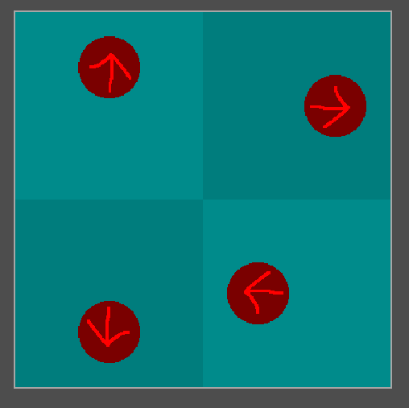

You can see the frames have a transparent border that could be removed. Regular Crop will remove all transparent margins in each frame:

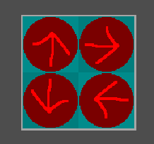

While Smart Crop will perform the trimming "globally", i.e. taking frame relative offsets:

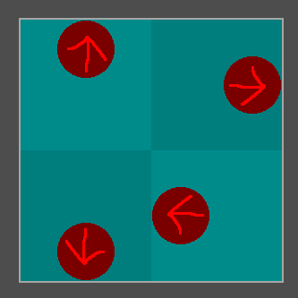

### Spritesheet repack

Spritesheet-inator can be used to import old spritesheets and convert them to newer format. See this spritesheet for example:

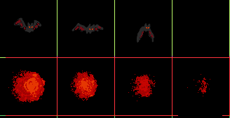

It's a sprite from Little Fighter 2. It has solid black background, frame separators, and extra margin in the bottom-right. This can be fixed using the Cut tool and Remove Color effect:

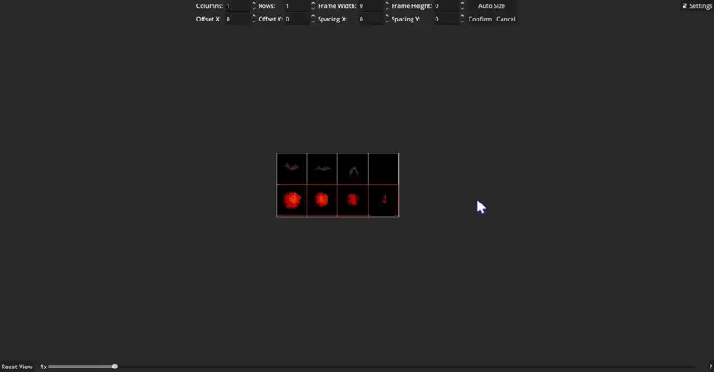

The final image is neatly cut and has transparent background:

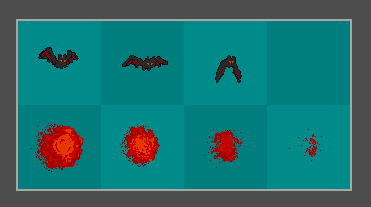

## Usage

### Running

To run Spritesheet-inator, either download an executable from [https://github.com/KoBeWi/Godot-Spritesheet-Generator/releases](Releases) or download the project and run using Godot Engine (requires 4.5 or newer). 

### Basics

This is the program's main screen that shows after you run it:

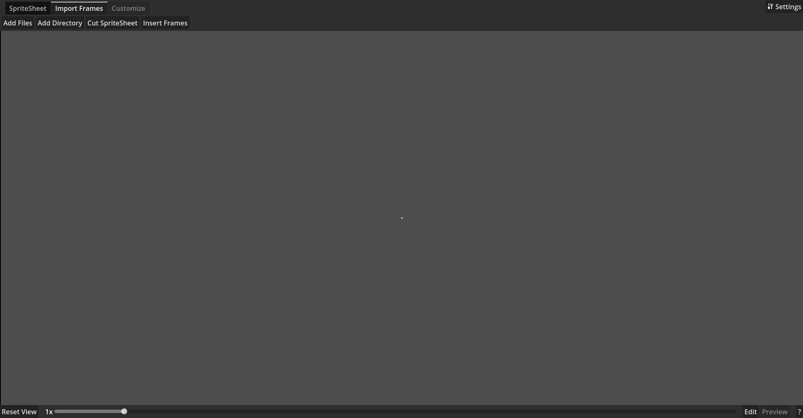

The interface is divided into 3 sections: top panel with tabs, spritesheet view, and bottom panel with navigation options and some menus.

To do anything, you need to first add frames to your spritesheet. You can do so in Import Frames tab. Once frames are added, the spritesheet view will show a preview of the spritesheet.

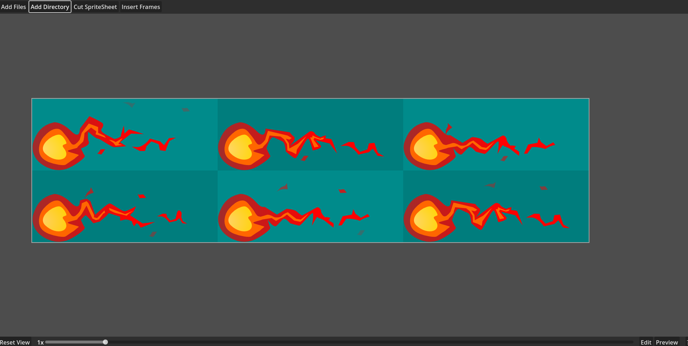

You can use middle mouse button to pan and zoom the view. The Preview option at the bottom allows you to preview the spritesheet's frames in motion (i.e. preview the animation). You can select frames with LMB and reorganize or delete them. The Edit button at the bottom opens editing panel that allows changing selected frames. The Customize tab at the top has various options for manipulating the whole spritesheet.

Once you are satisfied with the spritesheet, you can save it in the SpriteSheet tab. The sections below explain each feature in more details.

#### Spritesheet View

The view section shows the frames added to the spritesheet, organized in a grid. The transparent area is filled with a solid color, alternating in a checkerboard pattern. If frame's size is smaller than spritesheet's defined frame size, an outline will be displayed that shows the true image's size.

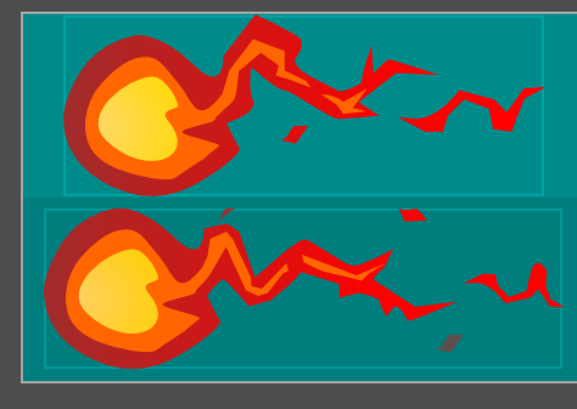

If the spritesheet has holes (parts without assigned frame), they will show as the background color.

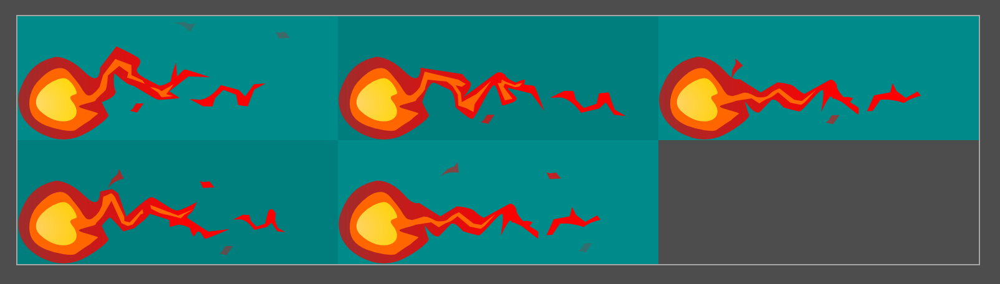

You can use the slider at the bottom to set precise zoom. The Reset View button will reset zoom and position (especially useful if your spritesheet moves out of view).

### SpriteSheet

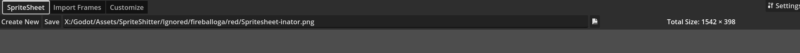

Here you can manage the spritesheet itself. The Create New button discards all frames and creates a fresh spritesheet, the Save button will save the spritesheet under the given path. There is also a label that shows the final size of the saved spritesheet.

The image path is set automatically when you import frames. By default the new spritesheet will be created in the same directory as the source files. The only supported save format is PNG.

### Import Frames

The Import Frames tab allows to add frames to the spritesheet. You can add individual files, whole directories or cut an existing spritesheet into individual frames. Supported image formats to import are `bmp`, `dds`, `exr`, `hdr`, `jpg`, `jpeg`, `png`, `tga`, `svg`, `svgz`, and `webp`.

The Insert Frames button reveals a few more options.

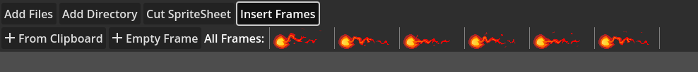

You can insert a new frame from system's clipboard, insert an empty frame, or insert any previously imported frame, including frames deleted from the spritesheet.

Whenever a new frame is added to the spritesheet, the frame size is updated.

#### Cut SpriteSheet

Selecting this option will prompt you to select a file and then open a special editor for cutting the spritesheet.

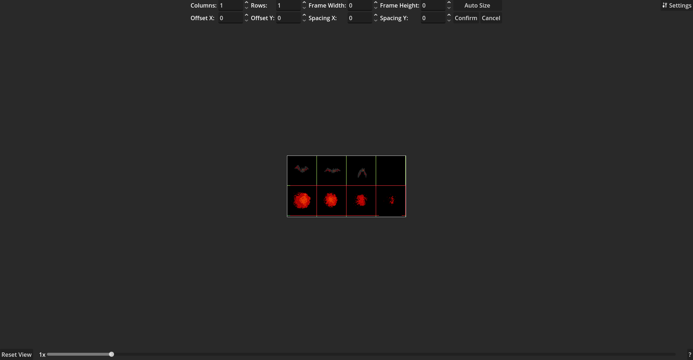

You can customize how much columns and rows to cut into, the offset of the spritesheet and spacing between frames (which will be removed). The editor will draw outlines of the new frames and dim out areas of the spritesheet that will be removed.

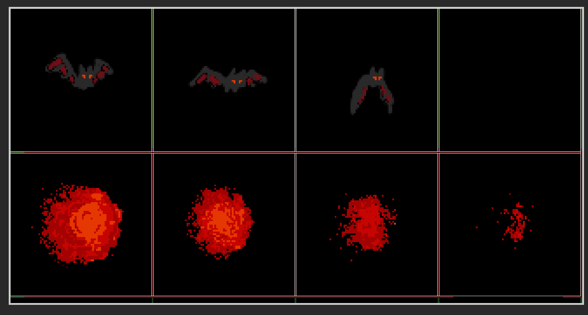

The frame size is determined by default from dividing the spritesheet size by columns and rows. You can also specify the size manually. By default, size of 0 means that the frames will have automatic size, but you can use Auto Size button to apply this size explicitly, which then you can adjust. Confirming the operation will cut the base image into frames and add them to your spritesheet.

### Customize

The customize tab is divided into multiple sub-tabs. They have various options for modifying the spritesheet. There is also a button for selecting or deselecting all frames at once.

#### Crop

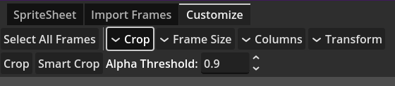

This tab allows you to crop the frames. Cropping will remove extraneous transparent borders from each image. You can do either regular crop or the so-called smart crop; the difference is explained above. Crop will additionally center frame images. Alpha Threshold parameter specifies the minimum alpha value for a pixel to be considered transparent.

#### Frame Size

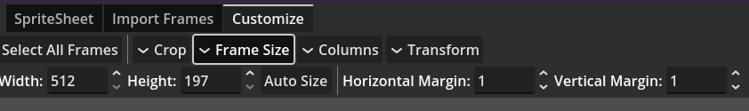

This tab allows you to adjust the size of spritesheet frame. By default the frame size is set to the biggest added frame, but you can make it smaller (which may cut some images) or bigger. In case the frame size is wrong, you can use Auto Size to adjust it.

Each frame also has a margin; it's an extra space on each side of the frame. The default margin value is 1, which is to avoid texture interpolation problems (i.e. frames leaking to other frames when displayed in the engine).

#### Columns

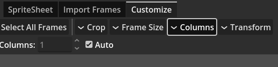

This tab allows you to set the number of columns in the spritesheet. For the most part you don't need to touch it, because when Auto option is enabled, the editor will automatically set an optimal number of columns. The algorithm makes sure that there's the least number of holes and the image layout is as close to square as possible, favoring vertical size over horizontal.

#### Transform

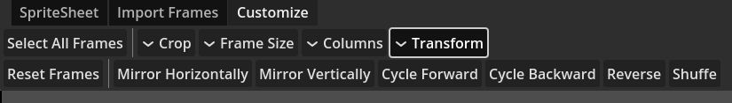

This tab allows performing some operations that modify the whole spritesheet, and especially its frame order. The Mirror options will flip the frames around the spritesheet's global center, the Cycle options will shift all frames by 1 position. The Reverse will reverse the order of frames and Shuffle will randomize the order. Note that Mirror will not work correctly if the spritesheet has holes.

The Reset Frames button will reset all frames to their original state, including order and missing frames.

### Edit

The Edit panel can be access with the button at the bottom.

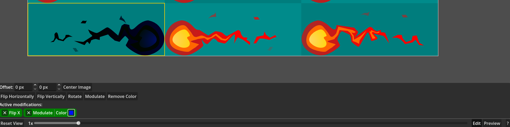

It's only usable when you have selected at least one frame. THere you can edit images's offset within the frame (if it's smaller than frame size), including option for centering it. Note that offset field might show incorrect value if multiple frames are selected, but you can still set it for many frames.

There are also various modifications that you can apply to your frame. Apply a modification by pressing the button with its name and remove it by pressing X button in the modifications list. Each modification can be applied only once for each frame, trying to add it again will replace the old instance.

You can apply a modification to multiple frames at once. This makes every frame share its parameters, so you can e.g. remove a color in every frame. The Crop is a special modification that can't be applied from Edit menu, but it can be deleted from there (though for single frame at a time).

#### Flip

Flips the image horizontally or vertically.

#### Rotate

Rotates the image. You can set the rotation degress: 90, 180, or 270. Note that changing frame's orientation may make the image go out of bounds.

#### Modulate

Modulates (multiplies) the image's color by the given color.

#### Remove Color

Removes the specified color from the frame. This is useful for removing non-transparent backgrounds.

### Preview

The Preview button in bottom-right opens the preview panel:

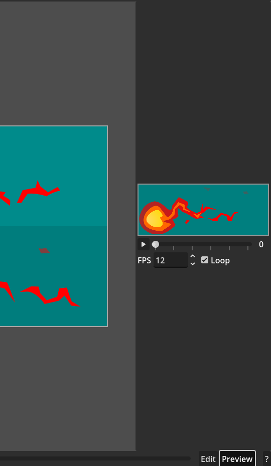

It allows to preview the spritesheet as animation. It will cycle between each frame of the spritesheet with the given FPS, with optional looping. The play button (triangle) will play or pause the animation. You can also seek manually using the slider.

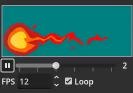

### Settings

The Settings panel can be opened in the top-right:

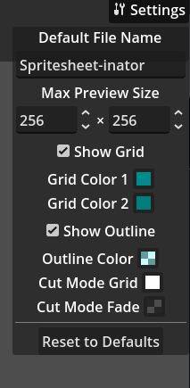

It allows customizing the appearance of Spritesheet-inator.
- **Default File Name:** The filename when path is auto-assigned after importing files.
- **Max Preview Size:** Maximum size of the preview in the preview panel. Bigger images will be scaled down proportionally.
- **Show Grid:** Toggles the checkerboard pattern.
- **Grid Color 1:** First color of the checkerboard pattern.
- **Grid Color 2:** Second color of the checkerboard pattern. Only used when grid option is enabled.
- **Show Outline:** Toggles the image size outline (when images are smaller than frame size).
- **Outline Color:** Color of the aforementioned outline.
- **Cut Mode Grid:** Color of the frame outlines when cutting spritesheet.
- **Cut Mode Fade:** Color of the dimming applied to discarded image areas when cutting spritesheet.

## Origin

The reason why this tool was created is that there isn't really any good spritesheet generator that can trim your frames. I had a big list of images that needed to be made into a spritesheet, but their problem was a huge transparent border around each frame. E.g. check this one (I added the outline to better denote the real size):

It's easy to crop an image, but each frame has a different size and after you crop them all, your spritesheet will be a mess. I made a quick tool that finds a "globally minimal size", so that frames are cropped, but don't "jump" when put into a spritesheet.

Eventually I made it into a fully-fledged editor plugin called Spritesheet Generator, and as I had more ideas, I reworked the UI, added some functionality, and now it's a spritesheet editing app xd

___
You can find all my addons on my [profile page](https://github.com/KoBeWi).

